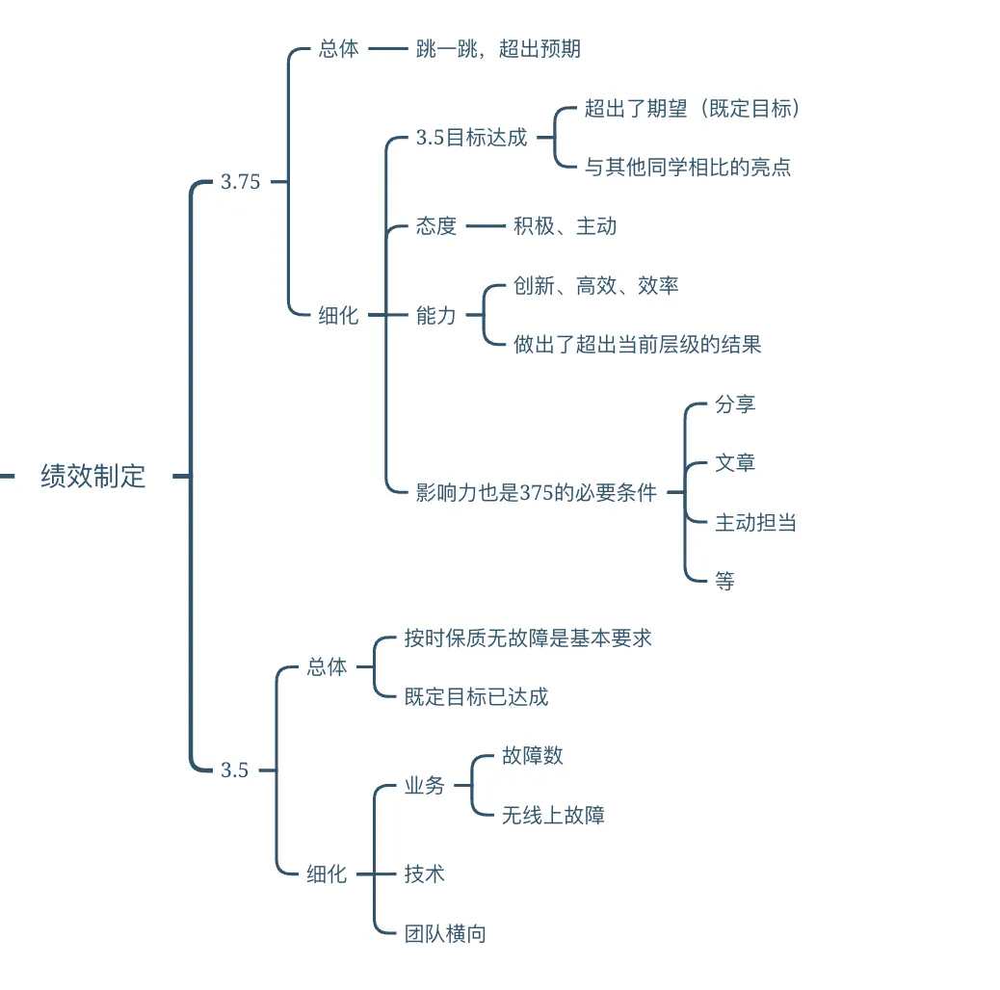
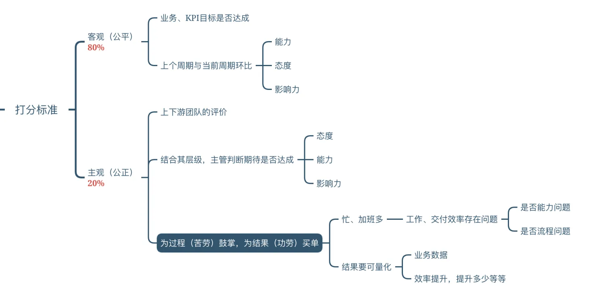
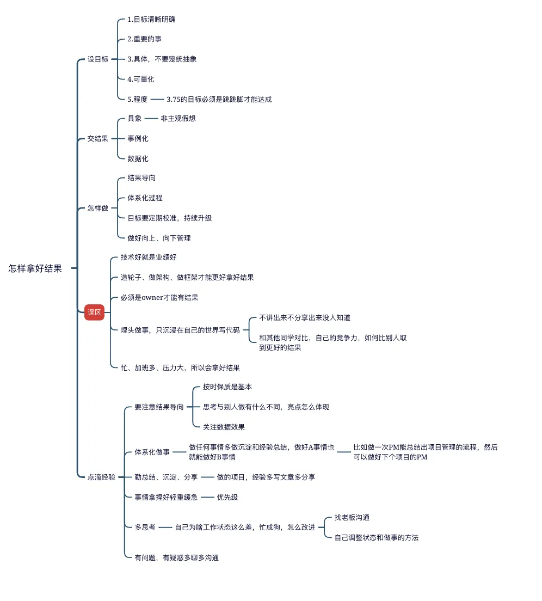

## 绩效管理
- 公平和公正
- 保持沟通，定期1-1，鼓励和了解
  - 360度，了解和反馈，包括：技术、沟通、协同、结果
- 绩效标准同步
  - 结果导向，为过程鼓掌，为结果买单
  - 制定规划
    - 
- 绩效评估，风险提前沟通
  - 状态不对的同学，及时发现和调整，预期提前告知，避免反扑
- 绩效反馈，及时和有效
  - 结果告知，总结当下，规划未来，更近一步还是继续深耕
  - 

## 团队人和事
- 团队阵型，合理搭配
  - 结合能力和态度、需求的难易度、需求的优先级考量进行分配
- 团队氛围，积极向上
  - 技术沉淀和分享、经验分享、业务交流
- 自驱力，主动学习、个人成长

## 团队管理和建设
- 基建、规范、流程、组件库沉淀、文档建设
- 研发效率和提效
- 稳定性和质量
- 体验和性能
- 团队建设、价值观、文化建设
- 沟通机制
  - 周会、周报等
  - 1-1
  
## 项目管理
- 项目管理专项
  - 重点::风险提前识别和规避
    - 真实了解技术方案、业务需求
    - 真实了解研发进度，定期跑代码，看效果

## 向上管理
  - 向上管理，持续学习，定期汇报
    - 汇报内容包含：
      - 项目进度和风险
      - 个人事项
      - 团队建设和其他事项汇报

## 团队协同
- 有默契靠默契，无默契靠规则、老板
- 保持钉钉沟通记录沟通重点事项

## 个人经验和心得
